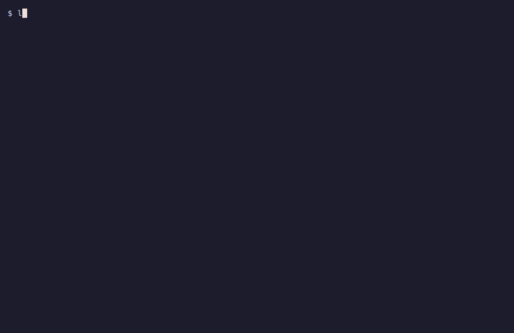

<h1 align="center">
  <br>
  LLMDoctor
</h1>

<p align="center">
  <strong>Scan local model stores, find setup problems, and check whether coding agents can use your local endpoint.</strong>
</p>

<p align="center">
  <a href="https://github.com/Arthur031221/LLMDoctor/stargazers"></a>
  <a href="https://github.com/Arthur031221/LLMDoctor/actions/workflows/ci.yml"></a>
  <a href="LICENSE"></a>
</p>

<p align="center">
  <a href="#quickstart">⚡ Quickstart</a> •
  <a href="#how-it-works">🔍 How it works</a> •
  <a href="#examples">📖 Examples</a> •
  <a href="#faq">💬 FAQ</a>
</p>

> [!TIP]
> Scan your local model stores without installing LLMDoctor:
> ```sh
> uvx --from git+https://github.com/Arthur031221/LLMDoctor LLMDoctor scan --offline
> ```

<p align="center">
  
</p>

## Why LLMDoctor

Each runtime keeps its own copy of large model files. Ollama hides weights behind sha256 blob names, so a matching 20 GB file in LM Studio can be hard to recognize. Moving models out of Ollama usually means downloading them again.

Chat templates can be fixed after a quantized model is released, leaving old local copies with broken tool-call behavior. Ollama can also load a smaller context window than the model supports and silently drop prompt content while returning HTTP 200.

Most tools focus on one store, one runtime, or basic OpenAI compatibility. LLMDoctor inventories local stores, checks templates and model versions, estimates memory fit, probes the endpoint behavior coding agents rely on, and prints concrete repair commands.

## Features

- 🔎 **Scans model stores:** Checks Ollama, LM Studio, the Hugging Face cache, MLX and transformers folders, plus extra paths.
- ♻️ **Finds wasted disk:** Detects duplicate weights across stores, orphan blobs, incomplete pulls, old Hugging Face revisions, and broken files.
- 🧩 **Checks templates and updates:** Compares local templates and model files with Hugging Face Hub or Ollama registry data without downloading weights.
- 🧮 **Estimates memory fit:** Adds model weights to an f16 KV cache estimate at the requested context and compares it with RAM and the macOS GPU wired limit.
- 🛠️ **Plans safe cleanup:** Previews changes by default, links only matching files, and waits until leftovers are old before deleting them.
- 📦 **Unbundles Ollama models:** Exposes existing Ollama blobs through named links without copying weights, and writes configs for llama-server, llama-swap, LM Studio, or MLX.
- 🧪 **Probes local endpoints:** Checks context truncation, tool calls, structured output, reasoning, token limits, prefix caching, speed, and RAM headroom.

## Quickstart

Requires Python 3.10 or newer. The package is not published on PyPI yet, so install from GitHub:

```sh
uv tool install git+https://github.com/Arthur031221/LLMDoctor
```

To run it once without installing:

```sh
uvx --from git+https://github.com/Arthur031221/LLMDoctor llm-doctor
```

The TIP command above scans every discovered model store and skips upstream lookups. This excerpt is from its real output; counts and findings depend on the machine:

```text
llm-doctor scan  1 stores, 51 models, 55.3 GB on disk (0.6 s)

Findings
WARN  incomplete        openai/clip-vit-large-patch14: a2bf730a0c7debf1...incomplete
      partial download, untouched for 4 days [528.6 MB]
      fix: llm-doctor fix --yes

0 errors, 1 warnings. 528.6 MB reclaimable, preview with `llm-doctor fix`.
Upstream checks skipped (--offline).
```

<details>
<summary><b>When the PyPI release is available</b></summary>

Once the package is published, these direct registry commands will work:

- `uvx llm-doctor`
- `pipx install llm-doctor`
- `pip install llm-doctor`

</details>

<details>
<summary><b>Command reference and configuration</b></summary>

Every command takes `--json` and `-h` or `--help`.

Common commands are `llm-doctor` to scan every model store, `llm-doctor fix` to preview dedupe and cleanup, `llm-doctor fix --yes` to apply the plan, `llm-doctor unbundle --to llama-server` to expose Ollama models to llama.cpp, and `llm-doctor endpoint http://localhost:11434` to probe an agent endpoint.

### `llm-doctor` and `llm-doctor scan`

Running `llm-doctor` with no subcommand scans every model store.

| Option | Default | Description |
|---|---|---|
| `-p, --path DIR` | | Extra folder with GGUF or MLX models, repeatable |
| `--ctx N` | 32768 | Context for the memory estimate |
| `--offline` | off | Skip Ollama registry and Hugging Face Hub lookups |
| `--no-hash` | off | Skip duplicate detection |
| `--min-size MB` | 16 | Ignore smaller files when looking for duplicates |
| `-v, --verbose` | off | Also show info notes, such as template differences from the base model |

Finding codes: `duplicate`, `orphan`, `incomplete`, `old-revision`, `broken`, `no-fit`, `tight-fit`, `template-stale`, `template-missing`, `template-vs-base`, `outdated`, `newer-revision`, `upstream-missing`, `store-problem`.

### `llm-doctor fix`

| Option | Default | Description |
|---|---|---|
| `-y, --yes` | off | Apply the plan. Without it nothing changes |
| `--hardlink` | off | Hardlinks instead of symlinks, on the same filesystem only |
| `--only KIND` | all | `dedupe`, `orphans`, or `incomplete`; repeatable or comma-separated |
| `--min-age MIN` | 60 | Minutes a leftover must be untouched before deletion |
| `-p, --path DIR`, `--min-size MB` | | As for scan |

### `llm-doctor unbundle`

| Option | Default | Description |
|---|---|---|
| `--to TARGET` | llama-server | `llama-server` presets INI, `llama-swap` config YAML, `lmstudio` folder layout, or `mlx` conversion script |
| `--out DIR` | `./ollama-unbundled` | For `lmstudio`, defaults to `~/.lmstudio/models/ollama` |
| `-m, --model NAME` | all | Only this Ollama model, repeatable |
| `--hardlink` | off | Hardlink instead of symlink; survives `ollama rm` |
| `--ctx N` | 32768 | Context to write when the Modelfile sets no `num_ctx` |
| `--llama-server PATH` | from PATH | Binary used in llama-swap commands |
| `--dry-run` | off | Show the plan and write nothing |

Then run `llama-server --models-preset ollama-unbundled/presets.ini` or `llama-swap --config ollama-unbundled/llama-swap.yaml`.

### `llm-doctor endpoint URL`

| Option | Default | Description |
|---|---|---|
| `-m, --model NAME` | loaded or first model | Model to test |
| `--api` | openai | `openai` for `/v1/chat/completions`, `ollama` for `/api/chat` |
| `--deep` | off | Add the 32k context level |
| `--budget S` | 90, or 300 with `--deep` | Time budget for all probes |
| `--only PROBE` | all | `context`, `tools`, `json`, `think`, `max-tokens`, `prefix-cache`, `speed`, `ram` |
| `--api-key KEY` | | Bearer token, also read from `LLM_DOCTOR_API_KEY` |

The endpoint command exits with status 1 when any check fails, so it works in scripts. Backends are detected from `/api/version` (Ollama), `/props` (llama-server, including router mode), and `/api/v0/models` (LM Studio). Other servers are treated as generic OpenAI-compatible endpoints.

### Environment variables

| Variable | Used for |
|---|---|
| `OLLAMA_MODELS` | Ollama store location |
| `HF_HUB_CACHE`, `HF_HOME` | Hugging Face cache location |
| `HF_TOKEN`, `HF_ENDPOINT` | Gated repos and mirrors for upstream checks |
| `LLM_DOCTOR_PATHS` | Extra model folders, separated by `:` |
| `LLM_DOCTOR_HOME` | Hash cache and fix log location, default `~/.llm-doctor` |
| `LLM_DOCTOR_API_KEY` | Bearer token for `endpoint` |

</details>

## Examples

### Cross-store scan and cleanup

This scan of Ollama, LM Studio, and Hugging Face cache fixtures found duplicate weights, an outdated model file, and a stale chat template:[^2]

```text
llm-doctor scan  3 stores, 7 models, 7.0 GB on disk (4.7 s)

store        root                      models  size
ollama       ~/.ollama/models          3       4.3 GB
lmstudio     ~/.lmstudio/models        1       396.7 MB
huggingface  ~/.cache/huggingface/hub  3       2.3 GB

Findings
WARN  duplicate         hf.co/unsloth/Qwen3-0.6B-GGUF:Q4_K_M, unsloth/Qwen3-0.6B-GGUF/Qwen3-0.6B-Q4_K_M
      2 copies of the same 396.7 MB file in lmstudio, ollama [396.7 MB]
      fix: llm-doctor fix --yes
WARN  outdated          unsloth/Qwen3-0.6B-GGUF/Qwen3-0.6B-Q4_K_M
      unsloth/Qwen3-0.6B-GGUF has a newer Qwen3-0.6B-Q4_K_M.gguf
      fix: hf download unsloth/Qwen3-0.6B-GGUF Qwen3-0.6B-Q4_K_M.gguf
WARN  template-stale    unsloth/Qwen3-0.6B-GGUF/Qwen3-0.6B-Q4_K_M
      chat template differs from unsloth/Qwen3-0.6B-GGUF on the Hub (local 8428c815ac94, upstream 5da44855ab7e, +7/-6 lines)
      fix: hf download unsloth/Qwen3-0.6B-GGUF Qwen3-0.6B-Q4_K_M.gguf
```

`llm-doctor fix --yes` replaced the LM Studio copy with a symlink to the Ollama blob and reclaimed 396.7 MB. The next scan reported no duplicates. The stale template came from the 2025-05-09 revision of that GGUF: it reads `message.content` without checking for null, even though assistant turns with only tool calls often have null content. A later upload fixed it.

### Endpoint readiness

On a MacBook Air, Ollama 0.34.4 served qwen3:1.7b at 4,096 tokens, one tenth of its 40,960-token model limit. A 6,973-token probe got HTTP 200 after the server kept only the final 2,050 tokens, with no error or warning from Ollama.[^1]

This probe of the same Ollama used its default settings:[^1]

```text
Context: 4,096 effective of 40,960 advertised, FAIL

check            result  detail
context          FAIL    4,096 effective of 40,960 advertised (server loaded 4,096). front of a 6,973-token prompt was dropped, server kept 2,050 tokens
tool call        PASS    Read(file_path=..., limit=..., offset=...) with valid arguments
tool result      PASS    tool result accepted and used
parallel tools   PASS    2 calls in one response
streaming tools  PASS    tool_calls arrived in 1 stream delta, arguments valid
json schema      PASS    output matches the schema
think tags       PASS    reasoning returned separately in `reasoning`
max_tokens       PASS    stopped at 16 tokens, finish_reason length
prefix cache     PASS    TTFT 3.29 s then 0.35 s on a repeated 2,490-token prefix, 2,475 tokens cached
speed 1k         INFO    TTFT 1.85 s, prefill 532 tok/s, decode 40.8 tok/s
speed 8k         SKIP    a prompt of 8,192 tokens does not fit the 4,096-token window
ram headroom     PASS    3.7 GiB available of 24.0 GiB, model resident 1.7 GiB

Fixes for ollama
1. Raise Ollama's context window. Ollama loaded qwen3:1.7b with a 4,096-token window. This model needs about 3.5 GiB of KV cache at 32,768 tokens. Server-wide: `OLLAMA_CONTEXT_LENGTH=32768 ollama serve`, or for the menu bar app `launchctl setenv OLLAMA_CONTEXT_LENGTH 32768` and restart Ollama.
2. Or per model: `printf 'FROM qwen3:1.7b\nPARAMETER num_ctx 32768\n' > Modelfile && ollama create qwen3-32k -f Modelfile`, then point the agent at the new name.
3. The OpenAI-compatible /v1 endpoint has no num_ctx field, so a client cannot raise the window per request. Ollama's native /api/chat accepts options.num_ctx.
```

After applying fix 2, the same probe verified 16,384 tokens with no truncation and every check passed.

## How it works

LLMDoctor reads local manifests and model files, hashes only files that need comparison, checks upstream metadata when online, and turns its findings into cleanup plans or endpoint-specific advice.

<details>
<summary><b>Stores and duplicate detection</b></summary>

**Stores.** Ollama manifests (`manifests/<host>/<namespace>/<model>/<tag>`) list layers by media type: weights, projector, adapter, params, template, and system. Blobs that no manifest references are orphans. `-partial` files are unfinished pulls. The Hugging Face cache is read from `refs`, `snapshots`, and `blobs`, including the huggingface_hub 2.0 layout where each repo blob is a symlink into a shared, xet-hashed store. LM Studio folders follow `<publisher>/<repo>/<file>.gguf`. Folders with `config.json` next to `*.safetensors` are MLX or transformers models.

**Duplicates.** Files are grouped by size first. Only files that share a size with another physical file get hashed, and only if the store does not already name them by sha256. Ollama and Hugging Face LFS blobs are named by their sha256, so in practice only LM Studio and loose files are read. Hashes are cached in `~/.llm-doctor/cache.json` keyed by path, size, mtime, and inode. Hardlinks and existing symlinks count once.

</details>

<details>
<summary><b>GGUF headers and memory fit</b></summary>

**GGUF headers.** LLMDoctor parses GGUF metadata itself and skips tokenizer arrays by length. On the 1.4 GB qwen3:1.7b blob that takes 39 ms, compared with 2.0 s for gguf-py's `GGUFReader`.[^3] The test suite checks the parser against gguf-py on generated files.

**Memory fit.** Weights plus an f16 KV cache at the target context (`--ctx`, default 32,768, capped at the model's trained context). KV bytes are `layers x kv_heads x (key_dim + value_dim) x 2 x tokens`, with per-layer KV heads, sliding-window layers, and MLA handled when the metadata describes them. The result is compared with physical RAM and the macOS GPU wired limit (`iogpu.wired_limit_mb`, or about two thirds of RAM when unset on machines up to 36 GB).

</details>

<details>
<summary><b>Templates and model updates</b></summary>

For Hugging Face GGUFs, the Hub `paths-info` API gives the upstream sha256 of the same file. If it differs, LLMDoctor reads the upstream GGUF header with an HTTP range request, without downloading the weights, and compares chat templates after whitespace normalization. It also compares with the base model's `tokenizer_config.json` or `chat_template.jinja` when the GGUF or model card names one. That comparison is a hint only, since quantizers patch templates on purpose. For Ollama, the registry manifest for the same tag is compared layer by layer, so a template-only update is reported as a few KB to pull.

</details>

<details>
<summary><b>Fixes and change log</b></summary>

`fix` is a dry run by default. Duplicates are replaced by a symlink, or a hardlink with `--hardlink`, to one kept copy. The kept copy comes from the Hugging Face cache first, then Ollama, then LM Studio and plain folders. Files inside the Hugging Face cache are never rewritten because `huggingface_hub` reference-counts them. Orphans and partial downloads are deleted only when untouched for `--min-age` minutes, so an active pull is safe. Every change goes to `~/.llm-doctor/fix-log.jsonl`.

</details>

<details>
<summary><b>Ollama export</b></summary>

Each Ollama model becomes a named symlink to its blob. Vision projectors go next to the model as `mmproj-<name>.gguf` in their own folder, the layout `llama-server --models-dir` expects. Modelfile parameters map to llama-server flags (`num_ctx` to `ctx-size`, `temperature` to `temp`, `top_k`, `top_p`, `min_p`, `repeat_penalty`, and a dozen more). The preset INI this writes was checked against llama-server b11146 in router mode, and the endpoint probe then measured exactly the context it set.

</details>

<details>
<summary><b>Endpoint probes</b></summary>

A calibration request learns the server's characters per token. The context probe then sends prompts at 85 percent of the 2k, 4k, 8k, and 16k levels, or 32k with `--deep`. Each prompt has a random code at the very start and another at the very end, and asks for both. The server's own `prompt_tokens` count is the main signal: when it is far below what was sent, the prompt was truncated, and the missing code shows which end was cut. A model that forgets a code while the server counted every token is reported as weak recall, not truncation. Tool probes use five tools shaped like a coding agent's (Read, Write, Edit, Bash, Grep) and validate every argument object against its JSON schema. Every request is capped by a shared time budget, 90 seconds by default.

</details>

### Compared tools

| Tool | What it does | Where LLMDoctor differs |
|---|---|---|
| LLMDoctor | Scans Ollama, LM Studio, HF cache and MLX; finds cross-store duplicates, orphans, stale templates and updates; exports Ollama models; probes endpoints and gives fixes | It prints model download or update commands but does not download or update models itself, and it does not run models |
| [sammcj/gollama](https://github.com/sammcj/gollama) | Ollama model manager TUI for listing, sorting, deleting, copying, editing Modelfiles, and estimating vRAM and context | It does not scan other stores; LM Studio linking was removed in v2.0.1; it does not detect duplicates or orphans, check updates or templates, or probe endpoints |
| [llamastash](https://github.com/llamastash/llamastash) | Runtime manager that finds GGUFs in HF, Ollama, and LM Studio caches, estimates memory with KV, pairs mmproj files, and launches and routes models | Its dedupe collapses symlinks in its own model list rather than reclaiming disk; it has no upstream template or version checks and no endpoint probe |
| [ollama-to-lmstudio-symlinks](https://github.com/qaribhaider/ollama-to-lmstudio-symlinks) | Links models between Ollama and LM Studio, pairs mmproj files, groups shards, and cleans broken links | It does not cover other stores, parameter translation, llama-server or llama-swap configs, or template and update checks |
| [chatpin](https://github.com/cloudpayload/chatpin) | Pins a reviewed chat template, diffs it against an upstream chosen by the user, and fails CI when it changes | It does not find which local models are stale or scan stores |
| `hf cache ls` / `hf cache prune` (huggingface_hub) | Sizes, revisions, and cleanup inside the Hugging Face cache | It does not cover other stores, cross-store duplicates, or template checks |
| [compatcanary](https://github.com/CognizenOrg/compatcanary) | OpenAI-compatibility probes for model list, chat, streaming, tool calling, structured output, and Responses API, with a score | It does not test context truncation, reasoning leakage, prefix cache or speed, or provide backend-specific fixes |

## FAQ

<details>
<summary><b>Does it download or update models?</b></summary>

No. It tells you what is stale and prints the `ollama pull` or `hf download` command.

</details>

<details>
<summary><b>Is `fix` safe?</b></summary>

It links files only when their sha256 matches and deletes orphans and partial downloads only when they are older than `--min-age`. With symlinks, removing the kept copy with `ollama rm` breaks linked copies. Use `--hardlink` if your stores share a filesystem and you want each store to stay independent.

</details>

<details>
<summary><b>Does it support Ollama's newer non-GGUF layouts?</b></summary>

Manifests with unknown layer types are scanned, sized, and checked for orphans. `unbundle` only exports GGUF weights and says so for other layouts.

</details>

<details>
<summary><b>Why does `--to mlx` write a script instead of files?</b></summary>

mlx-lm cannot load Ollama's GGUF k-quants. The script runs `mlx_lm.convert` on the original Hugging Face repo when the GGUF metadata names it.

</details>

<details>
<summary><b>How exact is the memory estimate?</b></summary>

It adds weights and an f16 KV cache. It ignores compute buffers, usually a few hundred MB, quantized KV caches, where q8_0 halves the KV number, and runtime overhead. Treat `tight` as a warning, not a verdict.

</details>

<details>
<summary><b>How exact is the template check?</b></summary>

It compares text after whitespace normalization. It does not render templates, so two templates that differ only in formatting inside a Jinja block still count as different.

</details>

<details>
<summary><b>Does the endpoint probe cost money on hosted APIs?</b></summary>

It sends about 17 requests and up to about 50,000 prompt tokens with default settings. Point it at paid endpoints only if you mean to.

</details>

<details>
<summary><b>What does the probe not test?</b></summary>

It does not test output quality, long multi-turn agent sessions, concurrency, or rate limits. A small model can fail the marker test from weak recall, which is reported as a warning, not as truncation.

</details>

<details>
<summary><b>Which platforms are supported?</b></summary>

Built and tested on macOS with Apple Silicon. The store scanners and probe also run on Linux, which CI uses. Windows is untested.

</details>

## Related projects

- [gpuwho](https://github.com/Arthur031221/gpuwho): Shows which local process is using the GPU right now, a live view next to LLMDoctor's static inventory of the model store.
- [gpuwait](https://github.com/Arthur031221/gpuwait): Measures how much of a serving window a local model spends idle, a companion number to LLMDoctor's setup diagnosis.
- [ollama-verify](https://github.com/Arthur031221/ollama-verify): Checks the integrity of Ollama blobs LLMDoctor also inventories, narrower in scope and read-only.

## Contributing

Bug reports with `--json` output and store layouts that LLMDoctor gets wrong are the most useful contributions. See [CONTRIBUTING.md](CONTRIBUTING.md) and [open an issue](https://github.com/Arthur031221/LLMDoctor/issues).

## License

MIT licensed. See [LICENSE](LICENSE).

[^1]: Measured 2026-09-30 on a MacBook Air M5 with 24 GB, macOS 26, Ollama 0.34.4 from Homebrew with default settings, model `qwen3:1.7b` (Q4_K_M), `llm-doctor endpoint http://localhost:11434 --model qwen3:1.7b`. Three full runs found the same truncation, taking 13 s, 8 s (with `--api ollama`) and 71 s (while other builds loaded the machine). The 6,973-token figure is the probe's estimate from its calibration request. Ollama's own `prompt_tokens` for the 2k and 4k levels were within 1 percent of the estimate, and 2,050 for the 8k level. `/api/ps` reported `context_length: 4096`, and `ps` showed Ollama's runner started with `-c 4096 -np 1 --context-shift --keep 4`. With `PARAMETER num_ctx 32768` in a Modelfile, the probe verified 16,384 tokens in 57 s.
[^2]: Same machine and date. Besides the two Ollama library models, fixtures for this scan included `unsloth/Qwen3-0.6B-GGUF` Q4_K_M at revision 649a90f (May 2025) in the Hugging Face cache, `mlx-community/Qwen3-0.6B-4bit`, and `ollama pull hf.co/unsloth/Qwen3-0.6B-GGUF:Q4_K_M`, then a copy of that GGUF in `~/.lmstudio/models` as LM Studio would store it. The cache also held an MLX Whisper model from another project. The first scan, with an empty hash cache, took 11.8 s and hashed 396.7 MB. Later scans took 4.7 s, most of it Hub lookups.
[^3]: One run each on the same machine, `sha256-3d0b79...` (qwen3:1.7b, 1.36 GB, 27 metadata keys, 151,936-token vocabulary). gguf-py 0.19.0 also needs 0.6 s to import.
